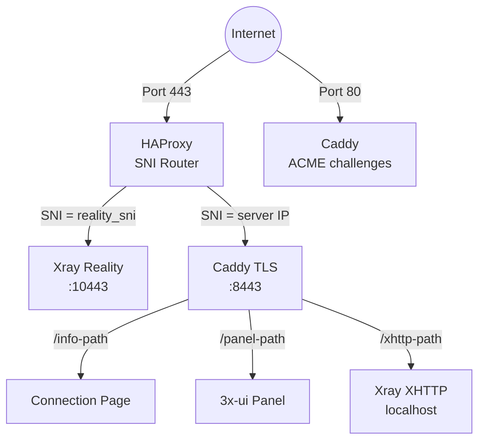
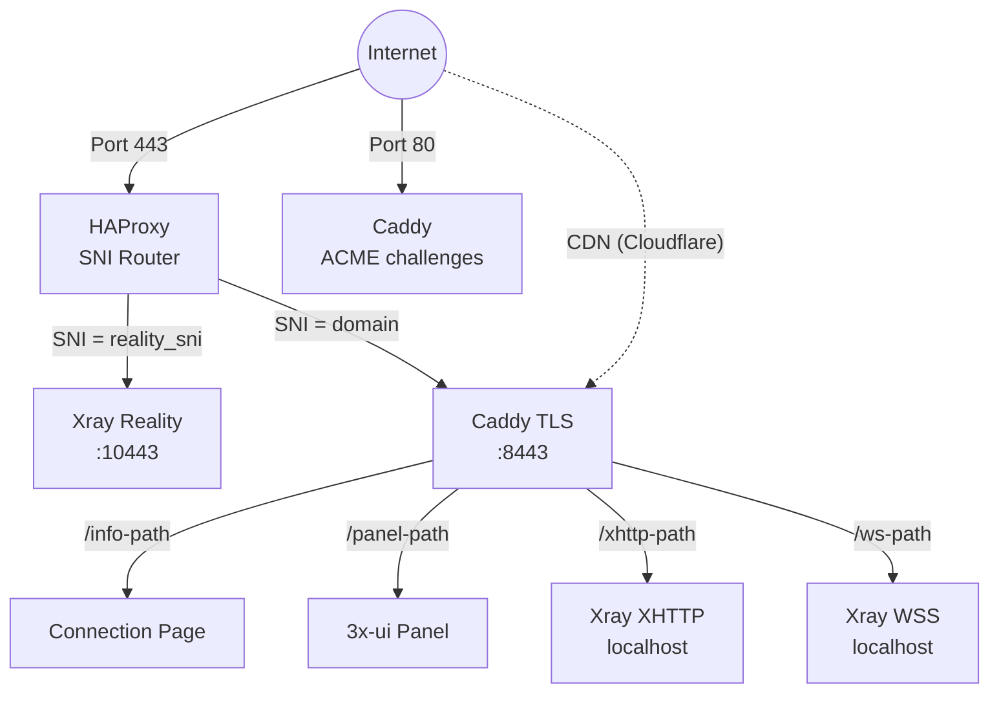
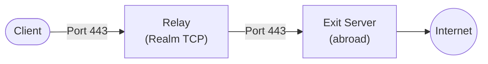

## Commands

### meridian deploy

Deploy proxy server to a VPS.

```
meridian deploy [IP] [flags]
```

| Flag | Default | Description |
|------|---------|-------------|
| `--sni HOST` | www.microsoft.com | Site that Reality impersonates |
| `--domain DOMAIN` | (none) | Enable domain mode with CDN fallback |
| `--email EMAIL` | (none) | Email for TLS certificates |
| `--xhttp / --no-xhttp` | enabled | XHTTP transport |
| `--name NAME` | default | Name for the first client |
| `--user USER` | root | SSH user |
| `--harden / --no-harden` | enabled | Server hardening: SSH key-only + firewall |
| `--yes` | | Skip confirmation prompts |

### meridian client

Manage client access keys.

```
meridian client add NAME [--server NAME]
meridian client list [--server NAME]
meridian client remove NAME [--server NAME]
```

### meridian server

Manage known servers.

```
meridian server add [IP]
meridian server list
meridian server remove NAME
```

### meridian relay

Manage relay nodes — lightweight TCP forwarders that route traffic through a domestic server to an exit server abroad.

```
meridian relay deploy RELAY_IP --exit EXIT [flags]
meridian relay list [--exit EXIT]
meridian relay remove RELAY_IP [--exit EXIT] [--yes]
meridian relay check RELAY_IP [--exit EXIT]
```

| Flag | Default | Description |
|------|---------|-------------|
| `--exit/-e EXIT` | (required for deploy) | Exit server IP or name |
| `--name NAME` | (auto) | Friendly name for the relay (e.g., "ru-moscow") |
| `--port/-p PORT` | 443 | Listen port on relay server |
| `--user/-u USER` | root | SSH user on relay |
| `--yes/-y` | | Skip confirmation prompts |

**How relays work**: Client connects to the relay's domestic IP. Relay forwards raw TCP to the exit server abroad. All encryption is end-to-end between client and exit — the relay never sees plaintext. All protocols (Reality, XHTTP, WSS) work through the relay.

### meridian preflight

Pre-flight server validation. Tests SNI, ports, DNS, OS, disk, ASN without installing anything.

```
meridian preflight [IP] [--ai] [--server NAME]
```

### meridian scan

Find optimal SNI targets on the server's network using RealiTLScanner.

```
meridian scan [IP] [--server NAME]
```

### meridian test

Test proxy reachability from the client device. No SSH needed.

```
meridian test [IP] [--server NAME]
```

### meridian doctor

Collect system diagnostics for debugging. Alias: `meridian rage`.

```
meridian doctor [IP] [--ai] [--server NAME]
```

### meridian teardown

Remove proxy from server.

```
meridian teardown [IP] [--server NAME] [--yes]
```

### meridian update

Update CLI to latest version.

```
meridian update
```

### meridian --version

Show CLI version.

```
meridian --version
meridian -v
```

## Global flags

| Flag | Description |
|------|-------------|
| `--server NAME` | Target a specific named server |

## Server resolution

Commands that need a server follow this priority:
1. Explicit IP argument or `local` keyword (deploy on this server without SSH)
2. `--server NAME` flag (also accepts `--server local`)
3. Local mode detection (running on the server itself)
4. Single server auto-select (if only one saved)
5. Interactive prompt


## Technology stack

- **VLESS+Reality** (Xray-core) — proxy protocol that impersonates a legitimate TLS website. Censors probing the server see a real certificate (e.g., from microsoft.com). Only clients with the correct private key can connect.
- **3x-ui** — web panel for managing Xray, deployed as a Docker container. Meridian controls it entirely via REST API.
- **HAProxy** — TCP-level SNI router on port 443. Routes traffic by SNI hostname without terminating TLS.
- **Caddy** — reverse proxy with automatic TLS. In standalone mode, requests a Let's Encrypt IP certificate via ACME `shortlived` profile (6-day validity). Serves connection pages, reverse-proxies the panel, and proxies XHTTP/WSS traffic to Xray.
- **Docker** — runs 3x-ui (which contains Xray). All proxy traffic flows through the container.
- **Pure-Python provisioner** — `src/meridian/provision/` executes deployment steps via SSH. Each step gets `(conn, ctx)` and returns a `StepResult`.
- **uTLS** — impersonates Chrome's TLS Client Hello fingerprint, making connections indistinguishable from real browser traffic.

## Service topology

### Standalone mode (no domain)



HAProxy does **not** terminate TLS. It reads the SNI hostname from the TLS Client Hello and forwards the raw TCP stream to the appropriate backend.

Caddy requests a Let's Encrypt IP certificate via the ACME `shortlived` profile (6-day validity, auto-renewed). Falls back to self-signed if IP cert issuance is not supported.

XHTTP runs on a localhost-only port and is reverse-proxied by Caddy — no extra external port exposed.

### Domain mode



Domain mode adds VLESS+WSS as a CDN fallback path. Traffic flows through Cloudflare's CDN via WebSocket, making the connection work even if the server's IP is blocked.

### Relay topology



A relay node is a lightweight TCP forwarder running [Realm](https://github.com/zhboner/realm). The client connects to the relay's domestic IP, which forwards raw TCP to the exit server abroad. All encryption is end-to-end between client and exit — the relay never sees plaintext.

## How Reality protocol works

1. Server generates an **x25519 keypair**. Public key is shared with clients, private key stays on server.
2. Client connects on port 443 with a TLS Client Hello containing the camouflage domain (e.g., `www.microsoft.com`) as SNI.
3. To any observer, this looks like a normal HTTPS connection to microsoft.com.
4. If a **prober** sends their own Client Hello, the server proxies the connection to the real microsoft.com — the prober sees a valid certificate.
5. If the client includes valid authentication (derived from the x25519 key), the server establishes the VLESS tunnel.
6. **uTLS** makes the Client Hello byte-for-byte identical to Chrome's, defeating TLS fingerprinting.

## Docker container structure

The `3x-ui` Docker container contains:
- **3x-ui web panel** — REST API on port 2053 (internal)
- **Xray binary** at `/app/bin/xray-linux-*` (architecture-dependent path)
- **Database** at `/etc/x-ui/x-ui.db` (SQLite, stores inbound configs and clients)
- **Xray config** managed by 3x-ui (not a static file)

Meridian manages 3x-ui entirely via its REST API:
- `POST /login` — authenticate (form-urlencoded, returns session cookie)
- `POST /panel/api/inbounds/add` — create VLESS inbound
- `GET /panel/api/inbounds/list` — list inbounds (check before creating)
- `POST /panel/setting/update` — configure panel settings
- `POST /panel/setting/updateUser` — change panel credentials

## Caddy configuration pattern

Meridian writes to `/etc/caddy/conf.d/meridian.caddy` (never the main Caddyfile). The main Caddyfile gets a single line added: `import /etc/caddy/conf.d/*.caddy`. This allows Meridian to coexist with user's own Caddy configuration.

Caddy handles:
- Auto-TLS certificate (domain cert or Let's Encrypt IP cert via ACME `shortlived` profile)
- Reverse proxy for the 3x-ui panel (at a random web base path)
- Connection info page serving (hosted pages with shareable URLs)
- Reverse proxy for XHTTP traffic to Xray (path-based routing, all modes when XHTTP enabled)
- Reverse proxy for WSS traffic to Xray (domain mode only)

## Port assignments

| Port | Service | Mode |
|------|---------|------|
| 443 | HAProxy (SNI router) | All |
| 80 | Caddy (ACME challenges) | All |
| 10443 | Xray Reality (internal) | All |
| 8443 | Caddy TLS (internal) | All |
| localhost | Xray XHTTP | When XHTTP enabled |
| localhost | Xray WSS | Domain mode |
| 2053 | 3x-ui panel (internal) | All |

XHTTP and WSS ports are localhost-only — Caddy reverse-proxies to them on port 443.

## Provisioning pipeline

Steps execute sequentially via `build_setup_steps()`. Each step gets `(conn, ctx)` and returns a `StepResult`.

| # | Step | Module | Purpose |
|---|------|--------|---------|
| 1 | InstallPackages | `common.py` | OS packages |
| 2 | EnableAutoUpgrades | `common.py` | Unattended upgrades |
| 3 | SetTimezone | `common.py` | UTC |
| 4 | HardenSSH | `common.py` | Key-only auth |
| 5 | ConfigureBBR | `common.py` | TCP congestion control |
| 6 | ConfigureFirewall | `common.py` | UFW: 22 + 80 + 443 |
| 7 | InstallDocker | `docker.py` | Docker CE |
| 8 | Deploy3xui | `docker.py` | 3x-ui container |
| 9 | ConfigurePanel | `panel.py` | Panel credentials |
| 10 | LoginToPanel | `panel.py` | API auth |
| 11 | CreateRealityInbound | `xray.py` | VLESS+Reality |
| 12 | CreateXHTTPInbound | `xray.py` | VLESS+XHTTP |
| 13 | CreateWSSInbound | `xray.py` | VLESS+WSS (domain) |
| 14 | VerifyXray | `xray.py` | Health check |
| 15 | InstallHAProxy | `services.py` | SNI routing |
| 16 | InstallCaddy | `services.py` | TLS + reverse proxy |
| 17 | DeployConnectionPage | `services.py` | QR codes + page |

## Credential lifecycle

1. **Generate**: random credentials (panel password, x25519 keys, client UUID)
2. **Save locally**: `~/.meridian/credentials/<IP>/proxy.yml` — saved BEFORE applying to server
3. **Apply**: panel password changed, inbounds created
4. **Sync**: credentials copied to `/etc/meridian/proxy.yml` on server
5. **Re-runs**: loaded from cache, not regenerated (idempotent)
6. **Cross-machine**: `meridian server add IP` fetches from server via SSH
7. **Uninstall**: deleted from both server and local machine

## File locations

### On the server
- `/etc/meridian/proxy.yml` — credentials and client list
- `/etc/caddy/conf.d/meridian.caddy` — Caddy config
- `/etc/haproxy/haproxy.cfg` — HAProxy config
- Docker container `3x-ui` — Xray + panel

### On the local machine
- `~/.meridian/credentials/<IP>/` — cached credentials per server
- `~/.meridian/servers` — server registry
- `~/.meridian/cache/` — update check throttle cache
- `~/.local/bin/meridian` — CLI entry point (installed via uv/pipx)


## Which tool to use

```
BEFORE INSTALL           → meridian preflight IP
  "Will this server work for Meridian?"
  Tests: SNI reachability, port 443, DNS, OS, disk space.

AFTER INSTALL, CAN'T CONNECT → meridian test IP
  "Is the proxy reachable from where I am right now?"
  Tests: TCP port 443, TLS handshake (Reality), domain HTTPS.
  No SSH needed — runs from the client device.

AFTER INSTALL, SOMETHING BROKE → meridian doctor IP
  "Collect everything for debugging."
  Collects: server OS, Docker, 3x-ui logs, ports, firewall, SNI, DNS.
```

Add `--ai` to preflight or doctor for an AI-ready diagnostic prompt.

## Can't connect at all

### Port 443 not reachable

**Causes:**
1. Cloud provider firewall / security group blocks port 443 inbound
2. ISP or network blocks the server IP entirely
3. Server is down or proxy is not running
4. UFW on the server doesn't allow port 443

**Fixes:**
1. Check cloud provider console — ensure port 443/TCP is allowed inbound
2. Try from a different network (mobile data, another Wi-Fi)
3. SSH in and check: `docker ps` (is 3x-ui running?), `ss -tlnp sport = :443`
4. Check UFW: `ufw status` — should show 443/tcp ALLOW

### TLS handshake fails

**Causes:**
1. Xray is not running inside the Docker container
2. Port 443 is occupied by another service
3. Reality SNI target is unreachable from the server

**Fixes:**
1. Check Xray: `docker logs 3x-ui --tail 20`
2. Check port: `ss -tlnp sport = :443` — should be haproxy
3. Test SNI: `meridian preflight IP`

### Domain not reachable

**Causes:**
1. DNS not pointing to server IP
2. Caddy not running or failed to get TLS certificate
3. HAProxy not routing domain SNI correctly

**Fixes:**
1. Check DNS: `dig +short yourdomain.com @8.8.8.8`
2. Check Caddy: `systemctl status caddy`
3. Check HAProxy: `/etc/haproxy/haproxy.cfg`

## Connection drops after seconds

**Causes:**
1. System clock skew >30 seconds between client and server
2. MTU issues on the network path
3. ISP resetting long-lived TLS sessions

**Fixes:**
1. Server: `timedatectl set-ntp true`. Client: enable automatic date/time
2. Try a different network
3. Use WSS/CDN connection (domain mode)

## Setup fails

### Port 443 conflict

Another service (Apache, Nginx) is using port 443. Stop it or use a clean server. `meridian preflight` will tell you what's using the port.

### Docker installation fails

Conflicting Docker packages from distro repos. Meridian auto-removes them, but if Docker is already running with containers, it skips to avoid disruption.

### SSH connection errors

Test SSH manually: `ssh root@SERVER_IP`. Ensure you have key-based access. Use `--user` flag if not root.

### Xray fails to start (invalid JSON / MarshalJSON error)

The 3x-ui inbound `settings` or `streamSettings` fields contain corrupted JSON. This happens when `settings` is sent as a nested object instead of a JSON string — the 3x-ui Go struct expects a `string` type. The API returns `success: true` but stores only the first key name instead of the full JSON.

**Fix:** Uninstall and reinstall: `meridian teardown IP && meridian deploy IP`. To verify the database: `sqlite3 /opt/3x-ui/db/x-ui.db "SELECT settings FROM inbounds;"` — each field should be valid JSON.

### XHTTP inbound creation fails (port conflict)

In older versions (pre-v3.6.0), both Reality and XHTTP tried to use port 443. 3x-ui rejects duplicate ports.

**Fix:** Update to v3.6.0+. XHTTP now runs on a localhost-only port, routed through Caddy.

### Disk space insufficient

Less than 2GB free. Free up space: `docker system prune -af`, `journalctl --vacuum-time=1d`, check `/var/log/`.

### DNS resolution fails (domain mode)

Domain doesn't resolve to server IP yet. Update the DNS A record. Propagation is usually 5-15 minutes (up to 48 hours). Meridian warns if DNS doesn't resolve but lets you proceed.

## Was working, now stopped

**Most common cause:** Server IP got blocked. This is very common in censored regions.

**Fixes:**
1. Run `meridian test IP` — if TCP fails, the IP is likely blocked
2. Use the WSS/CDN link (domain mode)
3. Deploy a new server: get a new IP and re-run `meridian deploy`

Other causes:
- Server rebooted and Docker didn't auto-start → `docker start 3x-ui`
- Disk full → `df -h /`, `docker system prune -af`

## Slow speeds

1. Choose a server geographically closer (Finland, Netherlands, Sweden for Europe/Middle East)
2. Check server load: `htop` or `uptime`
3. Try WSS/CDN link — may have better routing through Cloudflare
4. Verify BBR is enabled: `sysctl net.ipv4.tcp_congestion_control`

**Do NOT** run other protocols (OpenVPN, WireGuard) on the same server — it flags the IP.

## AI-powered help

```
meridian doctor --ai
```

Copies a diagnostic prompt to your clipboard for use with any AI assistant.

Or collect diagnostics for a [GitHub issue](https://github.com/uburuntu/meridian/issues):

```
meridian doctor
```

## Relay not working

**Check relay health:**
```bash
meridian relay check RELAY_IP
```

**Common issues:**
- **Port conflict** — Another service is using port 443 on the relay server. Check with `ss -tlnp sport = :443` and stop the conflicting service.
- **Firewall blocking** — Ensure port 443 is open on the relay's cloud provider firewall / security group.
- **Exit server unreachable** — The relay must be able to reach the exit server on port 443. Test with `curl -I https://EXIT_IP`.
- **Relay not started** — Check the Realm service: `systemctl status meridian-relay`.

## Interpreting preflight output

| Check | What It Tests | If It Fails |
|-------|--------------|-------------|
| SNI target reachability | Can the server reach the camouflage site? | Server's outbound is restricted. Try a different SNI with `--sni` |
| SNI ASN match | Does the SNI target share a CDN/ASN with the server? | Use a global CDN domain. Avoid apple.com (Apple-owned ASN) |
| Port 443 availability | Is port 443 free or used by Meridian? | Another service is on 443. Stop it or use a clean server |
| Port 443 external reachability | Can the outside world reach port 443? | Cloud firewall blocks it. Open port 443/TCP inbound |
| Domain DNS | Does the domain resolve to server IP? | Update DNS A record |
| Server OS | Is it Ubuntu/Debian? | Other distros may work but are untested |
| Disk space | At least 2GB free? | Free up space |

## Interpreting doctor output

| Section | What to Look For |
|---------|-----------------|
| Local Machine | OS compatibility |
| Server | OS version, uptime (recent reboot?), disk/memory usage |
| Docker | Is 3x-ui container running? Status should be "Up" |
| 3x-ui Logs | Error messages, "failed to start" entries, certificate issues |
| Listening Ports | Port 443 should show haproxy. If missing, proxy isn't running |
| Firewall (UFW) | Port 443/tcp should be ALLOW. If not listed, it's blocked |
| SNI Target | Should show CONNECTED with a certificate chain |
| Domain DNS | Should resolve to server IP |

## Interpreting test output

| Check | Pass | Fail |
|-------|------|------|
| TCP port 443 | Server is network-reachable | Firewall, ISP block, or server down |
| TLS handshake | Reality protocol is working | Xray not running, port conflict, or SNI issue |
| Domain HTTPS | Caddy + HAProxy working | DNS, Caddy, or HAProxy issue |

If all checks pass but the VPN client still can't connect: re-scan the QR code, check device clock is accurate (within 30 seconds), or try a different app (v2rayNG, Hiddify).


## Basic deployment

```
meridian deploy 1.2.3.4
```

The wizard guides you through configuration. Or specify everything upfront:

```
meridian deploy 1.2.3.4 --sni www.microsoft.com --name alice --yes
```

## All flags

| Flag | Default | Description |
|------|---------|-------------|
| `--sni HOST` | www.microsoft.com | Site that Reality impersonates |
| `--domain DOMAIN` | (none) | Enable domain mode with CDN fallback |
| `--email EMAIL` | (none) | Email for TLS certificates (optional) |
| `--xhttp / --no-xhttp` | enabled | XHTTP transport (through port 443 via Caddy) |
| `--name NAME` | default | Name for the first client |
| `--user USER` | root | SSH user (non-root gets sudo automatically) |
| `--harden / --no-harden` | enabled | Server hardening: SSH key-only + firewall (skip with `--no-harden` if other services run on the server) |
| `--server NAME` | | Target a specific named server (for re-deploys) |
| `--yes` | | Skip confirmation prompts |

## Choosing an SNI target

The SNI (Server Name Indication) target is the domain that Reality impersonates. The default (`www.microsoft.com`) works well for most cases.

For optimal stealth, scan your server's network for same-ASN targets:

```
meridian scan 1.2.3.4
```

**Good targets** (global CDN):
- `www.microsoft.com` — Azure CDN, global
- `www.twitch.tv` — Fastly CDN, global
- `dl.google.com` — Google CDN, global
- `github.com` — Fastly CDN, global

**Avoid** `apple.com` and `icloud.com` — Apple controls its own ASN ranges, making the IP/ASN mismatch instantly detectable.

## Pre-flight check

Not sure if your server is compatible?

```
meridian preflight 1.2.3.4
```

Tests SNI target reachability, ASN match, port availability, DNS, OS compatibility, and disk space — without installing anything.

## Re-running deploy

It's safe to re-run `meridian deploy` at any time. The provisioner is fully idempotent:
- Credentials are loaded from cache, not regenerated
- Steps check existing state before acting
- No duplicate work

## Non-root deployment

```
meridian deploy 1.2.3.4 --user ubuntu
```

Non-root users get `sudo` automatically. The user must have passwordless sudo access.

## Local deployment

If you're running Meridian directly on the server (e.g. logged in via SSH as root):

```
meridian deploy local
```

This skips SSH entirely and runs all commands locally. The `local` keyword works with all commands:

```
meridian client add alice local
meridian preflight local
meridian scan local
```

Useful when SSH to self doesn't work (missing keys, firewall rules), for re-deploying on the same server, or in cloud-init startup scripts.

## Adding a relay node

After deploying your exit server, you can add a relay node for resilience. A relay is a lightweight TCP forwarder on a domestic server that routes traffic to your exit server abroad — useful when the exit IP gets blocked.

```bash
meridian relay deploy RELAY_IP --exit YOUR_EXIT_IP
```

Clients automatically receive relay URLs when you add or update their connection pages. See the [CLI reference](/docs/en/cli-reference/) for all relay commands.

