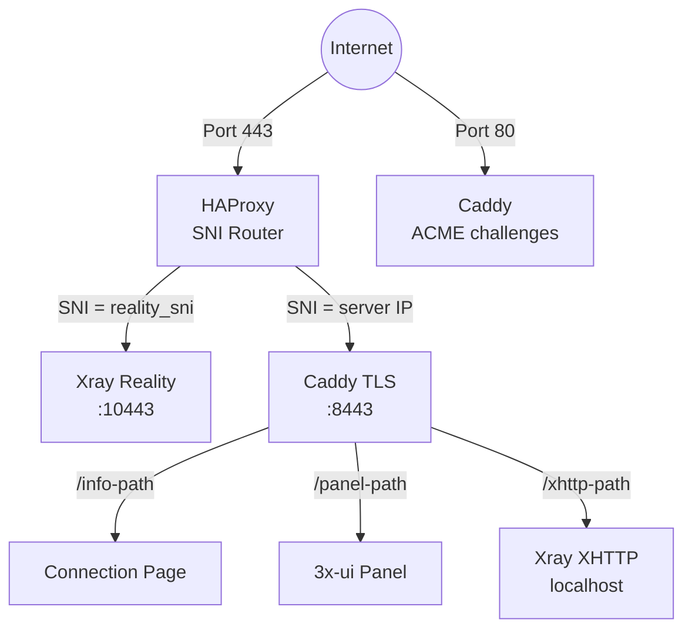
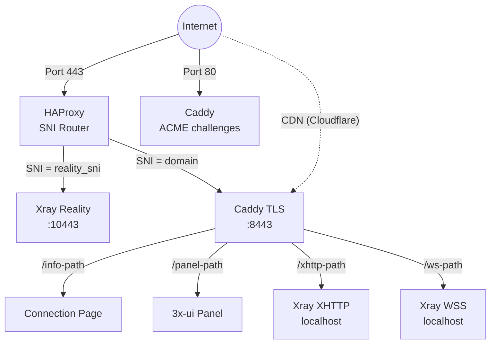
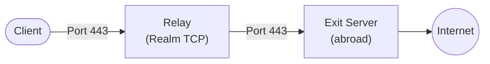

## 技术栈

- **VLESS+Reality**（Xray-core）— 伪装成合法 TLS 网站的代理协议。审查者探测服务器时会看到真实证书（例如来自 microsoft.com）。只有拥有正确私钥的客户端才能连接。
- **3x-ui** — 管理 Xray 的 Web 面板，以 Docker 容器部署。Meridian 完全通过 REST API 控制它。
- **HAProxy** — 端口 443 上的 TCP 级 SNI 路由器。根据 SNI 主机名路由流量，不终止 TLS。
- **Caddy** — 自动 TLS 反向代理。独立模式下通过 ACME `shortlived` 配置文件请求 Let's Encrypt IP 证书（6 天有效期）。提供连接页面、反向代理面板以及 XHTTP/WSS 流量到 Xray。
- **Docker** — 运行 3x-ui（包含 Xray）。所有代理流量通过容器传输。
- **纯 Python 配置器** — `src/meridian/provision/` 通过 SSH 执行部署步骤。每个步骤接收 `(conn, ctx)` 并返回 `StepResult`。
- **uTLS** — 模拟 Chrome 的 TLS Client Hello 指纹，使连接与真实浏览器流量无法区分。

## 服务拓扑

### 独立模式（无域名）

HAProxy **不**终止 TLS。它从 TLS Client Hello 中读取 SNI 主机名，并将原始 TCP 流转发到相应的后端。

Caddy 通过 ACME `shortlived` 配置文件从 Let's Encrypt 请求 IP 证书（有效期 6 天，自动续期）。如果不支持 IP 证书颁发，将回退到自签证书。

XHTTP 运行在仅限本地的端口上，由 Caddy 反向代理——无需暴露额外的外部端口。

### 域名模式

域名模式添加 VLESS+WSS 作为 CDN 回退路径。流量通过 Cloudflare 的 CDN 经由 WebSocket 流动，即使服务器 IP 被阻断也能工作。

### 中继拓扑

中继节点是一个轻量级 TCP 转发器，运行 [Realm](https://github.com/zhboner/realm)。客户端连接到中继的国内 IP，中继将原始 TCP 转发到国外的出口服务器。所有加密都是端到端的，在客户端和出口之间——中继永远看不到明文。

## Reality 协议如何工作

1. 服务器生成一个 **x25519 密钥对**。公钥与客户端共享，私钥保留在服务器上。
2. 客户端在端口 443 上连接，发送包含伪装域名（例如 `www.microsoft.com`）作为 SNI 的 TLS Client Hello。
3. 对于任何观察者来说，这看起来像一个到 microsoft.com 的正常 HTTPS 连接。
4. 如果一个**探针**发送自己的 Client Hello，服务器会将连接代理到真实的 microsoft.com——探针看到一个有效的证书。
5. 如果客户端包含有效的身份验证（从 x25519 密钥派生），服务器建立 VLESS 隧道。
6. **uTLS** 使 Client Hello 逐字节与 Chrome 相同，击败 TLS 指纹识别。

## Docker 容器结构

`3x-ui` Docker 容器包含：
- **3x-ui Web 面板** — 端口 2053 上的 REST API（内部）
- **Xray 二进制文件** 位于 `/app/bin/xray-linux-*`（依赖架构的路径）
- **数据库** 位于 `/etc/x-ui/x-ui.db`（SQLite，存储入站配置和客户端）
- **Xray 配置** 由 3x-ui 管理（非静态文件）

Meridian 完全通过 REST API 管理 3x-ui：
- `POST /login` — 认证（form-urlencoded，返回 session cookie）
- `POST /panel/api/inbounds/add` — 创建 VLESS 入站
- `GET /panel/api/inbounds/list` — 列出入站（创建前检查）
- `POST /panel/setting/update` — 配置面板设置
- `POST /panel/setting/updateUser` — 更改面板凭据

## Caddy 配置模式

Meridian 写入 `/etc/caddy/conf.d/meridian.caddy`（从不修改主 Caddyfile）。主 Caddyfile 添加一行：`import /etc/caddy/conf.d/*.caddy`。这允许 Meridian 与用户自己的 Caddy 配置共存。

Caddy 处理：
- 自动 TLS 证书（域名证书或通过 ACME `shortlived` 配置文件获取的 Let's Encrypt IP 证书）
- 3x-ui 面板的反向代理（在随机路径上）
- 连接页面服务（带有可分享 URL 的托管页面）
- XHTTP 流量到 Xray 的反向代理（基于路径的路由，启用 XHTTP 时在所有模式下生效）
- WSS 流量到 Xray 的反向代理（仅域名模式）

## 端口分配

| 端口 | 服务 | 模式 |
|------|---------|------|
| 443 | HAProxy (SNI 路由器) | 全部 |
| 80 | Caddy (ACME 挑战) | 全部 |
| 10443 | Xray Reality (内部) | 全部 |
| 8443 | Caddy TLS (内部) | 全部 |
| localhost | Xray XHTTP | 启用 XHTTP 时 |
| localhost | Xray WSS | 域名模式 |
| 2053 | 3x-ui panel (内部) | 全部 |

XHTTP 和 WSS 端口仅限本地——Caddy 在端口 443 上将它们反向代理。

## 配置管道

Meridian 通过一系列独立步骤配置服务器，每个步骤检查状态并只在必要时采取行动（幂等）。

| # | 步骤 | 模块 | 目的 |
|---|------|------|---------|
| 1 | InstallPackages | common | OS 包 |
| 2 | EnableAutoUpgrades | common | 无人值守升级 |
| 3 | SetTimezone | common | UTC |
| 4 | HardenSSH | common | 仅密钥认证 |
| 5 | ConfigureBBR | common | TCP 拥塞控制 |
| 6 | ConfigureFirewall | common | UFW: 22 + 80 + 443 |
| 7 | InstallDocker | docker | Docker CE |
| 8 | Deploy3xui | docker | 3x-ui 容器 |
| 9 | ConfigurePanel | panel | Panel 凭证 |
| 10 | LoginToPanel | panel | API 认证 |
| 11 | CreateRealityInbound | inbounds | VLESS+Reality |
| 12 | CreateXHTTPInbound | inbounds | VLESS+XHTTP |
| 13 | CreateWSSInbound | inbounds | VLESS+WSS (域名) |
| 14 | VerifyXray | inbounds | 健康检查 |
| 15 | InstallHAProxy | services | SNI 路由 |
| 16 | InstallCaddy | services | TLS + 反向代理 |
| 17 | DeployConnectionPage | services | 二维码 + 页面 |

## 凭证生命周期

1. **生成**：随机凭证（panel 密码、x25519 密钥、客户端 UUID）
2. **本地保存**：`~/.meridian/credentials/<IP>/proxy.yml`——应用到服务器之前保存
3. **应用**：panel 密码更改、入站创建
4. **同步**：凭证复制到服务器上的 `/etc/meridian/proxy.yml`
5. **重新运行**：从缓存加载，不会重新生成（幂等）
6. **跨机器**：`meridian server add IP` 通过 SSH 从服务器获取
7. **卸载**：从服务器和本地机器中删除

## 文件位置

### 服务器上
- `/etc/meridian/proxy.yml` — 凭据和客户端列表
- `/etc/caddy/conf.d/meridian.caddy` — Caddy 配置
- `/etc/haproxy/haproxy.cfg` — HAProxy 配置
- Docker 容器 `3x-ui` — Xray + 面板

### 本地机器上
- `~/.meridian/credentials/<IP>/` — 每个服务器的缓存凭据
- `~/.meridian/servers` — 服务器注册表
- `~/.meridian/cache/` — 更新检查缓存
- `~/.local/bin/meridian` — CLI 入口点（通过 uv/pipx 安装）
